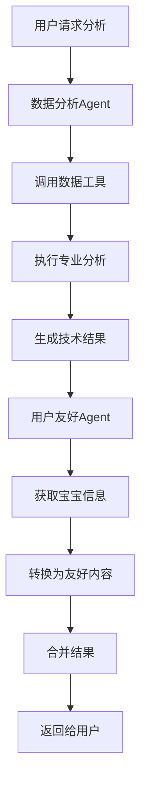

# 多Agent协作架构设计

## 🤖 架构概述

基于你的建议，我们实现了多Agent协作架构，将专业的AI分析转换为用户友好的内容，提升用户体验。

## 🏗️ Agent分工

### 1. 数据分析Agent (AnalysisChainBuilder)
**职责**: 专业数据分析
- 调用数据查询工具获取相关数据
- 执行深度的专业分析
- 生成技术性的洞察、警告、模式和预测
- 输出结构化的分析结果

**输出格式**:
```json
{
  "score": 65,
  "insights": [
    {
      "type": "feeding_pattern",
      "title": "混合喂养模式",
      "description": "宝宝采用母乳喂养和配方奶混合喂养模式",
      "priority": "medium",
      "category": "feeding_method"
    }
  ],
  "alerts": [...],
  "patterns": [...],
  "predictions": [...]
}
```

### 2. 用户友好Agent (UserFriendlyAgent)
**职责**: 内容转换和优化
- 将专业术语转换为通俗易懂的语言
- 生成温暖、鼓励的表达方式
- 提供具体可操作的建议
- 突出积极方面，给父母信心

**输出格式**:
```json
{
  "overall_summary": "您的宝宝整体发育良好，喂养方式很棒！",
  "score_explanation": "65分表示宝宝的喂养状况基本健康，有一些小地方可以优化",
  "key_highlights": [
    {
      "title": "营养摄入充足",
      "description": "宝宝的混合喂养模式确保了充足的营养摄入",
      "icon": "nutrition"
    }
  ],
  "improvement_areas": [
    {
      "area": "喂养规律性",
      "issue": "喂养时间间隔不太规律",
      "suggestion": "尝试建立固定的喂养时间表，有助于宝宝形成良好的作息",
      "priority": "medium",
      "difficulty": "easy"
    }
  ],
  "next_step_actions": [
    {
      "action": "建立喂养时间表",
      "timeline": "本周内",
      "benefit": "帮助宝宝建立规律作息，提高睡眠质量",
      "how_to": "每天在相同时间进行喂养，记录宝宝的反应"
    }
  ],
  "encouraging_words": "您是一位很棒的父母！宝宝在您的悉心照料下健康成长。"
}
```

## 🔄 协作流程



## 📊 最终输出结构

```json
{
  "code": 0,
  "message": "success",
  "data": {
    "analysis_id": "4",
    "status": "completed",
    "result": {
      "analysis_id": 0,
      "baby_id": 4,
      "analysis_type": "feeding",
      "score": 65,
      
      // 专业分析结果
      "insights": [...],
      "alerts": [...],
      "patterns": [...],
      "predictions": [...],
      
      // 用户友好结果 (新增)
      "user_friendly": {
        "overall_summary": "您的宝宝整体发育良好...",
        "score_explanation": "65分表示...",
        "key_highlights": [...],
        "improvement_areas": [...],
        "next_step_actions": [...],
        "encouraging_words": "您是一位很棒的父母！..."
      }
    }
  }
}
```

## 🎯 架构优势

### 1. **专业性与易懂性并存**
- 保留专业分析的准确性
- 提供通俗易懂的解释

### 2. **个性化体验**
- 基于宝宝信息定制内容
- 温暖、鼓励的语言风格

### 3. **可操作性强**
- 具体的改进建议
- 明确的行动步骤

### 4. **积极正面**
- 突出宝宝的优秀表现
- 给父母信心和支持

### 5. **模块化设计**
- Agent职责清晰
- 易于维护和扩展

## 🔧 技术实现

### Agent创建
```go
// 在AnalysisChainBuilder中集成UserFriendlyAgent
func NewAnalysisChainBuilder(
    chatModel model.ToolCallingChatModel,
    dataTools *tools.DataQueryTools,
    logger *zap.Logger,
) *AnalysisChainBuilder {
    userFriendlyAgent := NewUserFriendlyAgent(chatModel, logger)
    
    return &AnalysisChainBuilder{
        chatModel:         chatModel,
        dataTools:         dataTools,
        userFriendlyAgent: userFriendlyAgent,
        logger:            logger,
    }
}
```

### 协作流程
```go
// 分析完成后生成用户友好结果
result, err := b.parseAnalysisResponse(response.Content, analysis.AnalysisType, analysis.BabyID)
if err != nil {
    return nil, err
}

// 生成用户友好的分析结果
if err := b.generateUserFriendlyResult(ctx, result, analysis.BabyID); err != nil {
    b.logger.Error("生成用户友好结果失败", zap.Error(err))
    // 不影响主要分析结果，继续返回
}

return result, nil
```

## 🚀 使用示例

### 前端展示建议

**专业视图** (可折叠):
- 显示技术性的insights、alerts、patterns
- 适合有专业背景的用户

**友好视图** (默认展开):
- 显示overall_summary和score_explanation
- 突出key_highlights
- 展示improvement_areas和next_step_actions
- 显示encouraging_words

### API响应
现在的API响应包含两个层次的信息：
1. **专业层**: 原有的技术分析结果
2. **友好层**: 新增的用户友好内容

## 🎨 UI/UX建议

### 1. **卡片式布局**
```
┌─────────────────────────────────┐
│ 📊 总体评价                      │
│ 您的宝宝整体发育良好，喂养方式很棒！ │
│ 65分 - 基本健康，有优化空间        │
└─────────────────────────────────┘

┌─────────────────────────────────┐
│ ✨ 亮点表现                      │
│ 🥛 营养摄入充足                  │
│ 💤 睡眠质量良好                  │
└─────────────────────────────────┘

┌─────────────────────────────────┐
│ 💡 改进建议                      │
│ 📅 建立喂养时间表 (容易实施)      │
│ ⏰ 本周内开始                    │
└─────────────────────────────────┘
```

### 2. **渐进式信息展示**
- 默认显示友好内容
- 点击"查看详细分析"展开专业内容
- 使用图标和颜色增强视觉效果

## 🔮 扩展可能

### 1. **更多Agent类型**
- **建议Agent**: 专门生成个性化建议
- **预警Agent**: 专注于风险识别和预警
- **趋势Agent**: 分析长期发展趋势

### 2. **智能路由**
- 根据用户偏好选择Agent
- 基于分析类型调用不同Agent组合

### 3. **学习优化**
- 收集用户反馈
- 优化Agent的输出质量

## 📈 效果对比

### 之前 (单Agent)
```json
{
  "insights": [
    {
      "type": "duration_analysis",
      "title": "喂养时长不均衡",
      "description": "母乳喂养时长差异较大，从2分钟到180分钟不等，缺乏规律性",
      "priority": "high"
    }
  ]
}
```

### 现在 (多Agent)
```json
{
  "user_friendly": {
    "improvement_areas": [
      {
        "area": "喂养规律性",
        "issue": "宝宝的喂养时间还不太规律",
        "suggestion": "尝试建立固定的喂养时间表，这样有助于宝宝形成良好的作息习惯",
        "priority": "medium",
        "difficulty": "easy"
      }
    ]
  }
}
```

**改进效果**:
- ✅ 语言更温和友好
- ✅ 提供具体可行的建议
- ✅ 降低了焦虑感
- ✅ 增强了可操作性

---

通过多Agent协作，我们成功地将专业的AI分析转换为父母容易理解和实施的友好内容，大大提升了用户体验！
